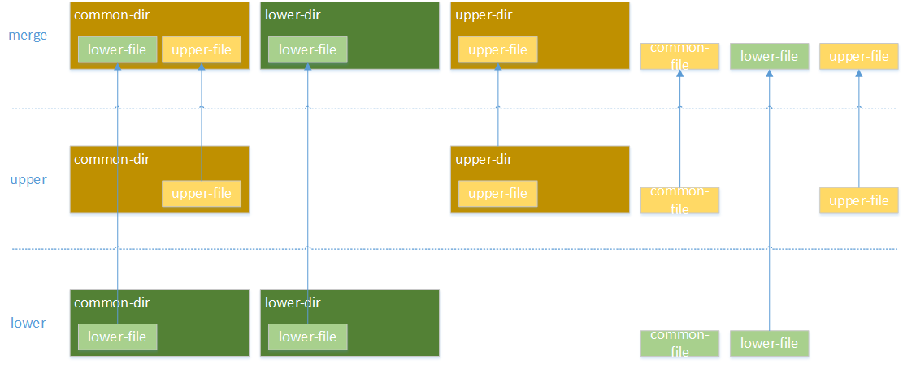

## go-docker

### 1. namespace隔离

| namespace | 系统调用函数 | 隔离内容 |
| --- | --- | --- |
| UTS | CLONE_NEWUTS | 主机和域名 |
| IPC | CLINE_NEWIPC | 信号量、消息队列、共享内存 |
| PID | CLONE_NEWPID | 进程编号 |
| Network | CLINE_NEWNET | 网络设备、网络栈、端口 |
| Mount | CLINE_NEWNS | 挂载点（文件系统） |
| User | CLINE_NEWUSER | 用户和用户组 |

### 2. cgroup隔离
linux Cgroup提供了对一组进程及子进程的资源限制、控制和统计能力，包含CPU、内存、存储、网络等，通过
Cgroup,可以方便的限制某个进程的资源占用，并且可以实时监控进程和统计信息。

### 3. OverlayFS文件系统
- 简介

OverlayFS是一种堆叠文件系统，它依赖并建立在其它的文件系统之上，不直接参与磁盘空间结构的划分，仅将原来文件系统中不同目录和文件进行“合并”。

- 挂载

挂载一个overlay文件系统，可以通过mount -t overlay -o <options> overlay <mount point>来实现。
```text
<options>参数如下：
(1) lowerdir=<dir>:指定用户需要挂载的lower层目录，lower层支持多个目录，用“:”间隔，优先级依次降低。最多支持500层。
(2) upperdir=<dir>：指定用户需要挂载的upper层目录，upper层优先级高于所有的lower层目录。
(3) workdir=<dir>：指定文件系统挂载后用于存放临时和间接文件的工作基础目录。
```

- 将lower和upper进行overlay，挂载到merge目录，临时workdir为work目录

```bash
mount -t overlay -o lowerdir=<lower>,upperdir=<upper>,workdir=<work> overlay merge
```

- 如下同样将lower和upper进行overlay到merge，但是merge为只读属性。
```shell
mount -t overlay -o lowerdir=upper:lower overlay merge
```

- OverlayFS使用规则

  - lowerdir和upperdir两个目录存在同名文件时，lowerdir的文件将会被隐藏，用户只能看到upperdir的文件。
  - lowerdir低优先级的同目录同名文件将会被隐藏。
  - 如果存在同名目录，那么lowerdir和upperdir目录中的内容将会合并。
  - 当用户修改mergedir中来自upperdir的数据时，数据将直接写入upperdir中原来目录中，删除文件也同理。
  - 当用户修改mergedir中来自lowerdir的数据时，lowerdir中内容均不会发生任何改变。因为lowerdir是只读的，用户想修改来自lowerdir数据时，overlayfs会首先拷贝一份lowerdir中文件副本到upperdir中。后续修改或删除将会在upperdir下的副本中进行，lowerdir中原文件将会被隐藏。
  - 如果某一个目录单纯来自lowerdir或者lowerdir和upperdir合并，默认无法进行rename系统调用。但是可以通过mv重命名。如果要支持rename，需要CONFIG_OVERLAY_FS_REDIRECT_DIR。


### 4. demo简单使用

- 打包demo

运行build-linux.sh脚本，将生成的go-docker拷贝到linux中

- 导入busybox到/home/cater目录下
```shell
root@Cater:/home/cater# ls
busybox  busybox.tar
root@Cater:/home/cater# pwd
/home/cater

```

- 创建overlayFS需要的文件夹

```shell
mkdir upper work merge
```
- 启动demo 
```shell
root@Cater:/home/cater# ./go-docker run -v aaa:/aaa -it "ls -al /"
{"level":"info","msg":"mount -t overlay -o lowerdir=/home/cater/busybox,upperdir=/home/cater/upper,workdir=/home/cater/work overlay /home/cater/merge/","time":"2022-05-15T21:54:08+08:00"}
{"level":"info","msg":"init come on","time":"2022-05-15T21:54:08+08:00"}
{"level":"info","msg":"command all is ls -al /","time":"2022-05-15T21:54:08+08:00"}
{"level":"info","msg":"current location is /home/cater/merge","time":"2022-05-15T21:54:08+08:00"}
total 52
drwxr-xr-x    1 root     root          4096 May 15 13:54 .
drwxr-xr-x    1 root     root          4096 May 15 13:54 ..
-rwxr-xr-x    1 root     root             0 May 15 01:54 .dockerenv
drwxr-xr-x    2 root     root          4096 May 15 13:53 aaa
drwxr-xr-x    2 root     root         12288 Apr 13 00:24 bin
drwxr-xr-x    2 root     root            40 May 15 13:54 dev
drwxr-xr-x    3 root     root          4096 May 15 01:54 etc
drwxr-xr-x    2 nobody   nobody        4096 Apr 13 00:25 home
dr-xr-xr-x  180 root     root             0 May 15 13:54 proc
drwx------    2 root     root          4096 Apr 13 00:25 root
drwxr-xr-x    2 root     root          4096 May 15 01:54 sys
drwxrwxrwt    2 root     root          4096 Apr 13 00:25 tmp
drwxr-xr-x    3 root     root          4096 Apr 13 00:25 usr
drwxr-xr-x    4 root     root          4096 Apr 13 00:25 var
{"level":"error","msg":"umount merge err: exit status 32","time":"2022-05-15T21:54:08+08:00"}
{"level":"error","msg":"delete work pace err: exit status 32","time":"2022-05-15T21:54:08+08:00"}
root@Cater:/home/cater#
```